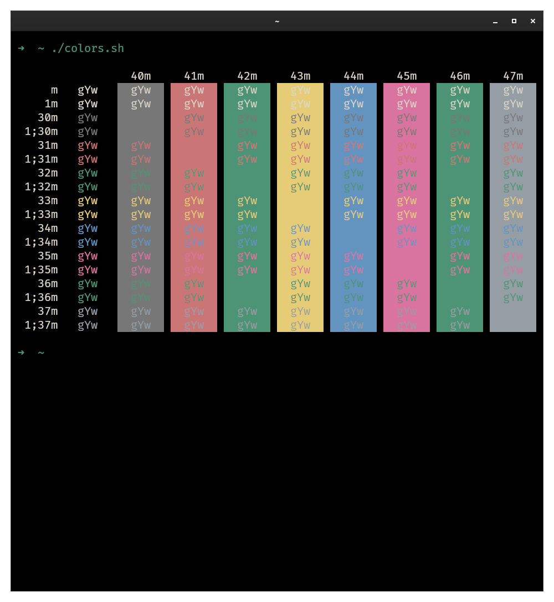

<h1 align="center">Vitesse Theme for Kitty</h1>


Based on [Antfu Vitesse Theme for VSCode](https://github.com/antfu/vscode-theme-vitesse/)



## Install

- Clone this repo

```sh
git clone --depth 1 https://github.com/devlulcas/kitty-theme-vitesse.git ~/.config/kitty/kitty-theme-vitesse
```

- Create a symlink to `theme.conf`

```sh
cd ~/.config/kitty
ln -s ./kitty-theme-vitesse/vitesse-black.conf theme.conf
```

- Add to your `kitty.conf`

```conf
include ./theme.conf
```

## Themes

- [x] Vitesse Black
- [ ] Vitesse Dark (WIP)
- [ ] Vitesse Dark Soft (WIP)
- [ ] Vitesse Light (WIP)
- [ ] Vitesse Light Soft (WIP)

